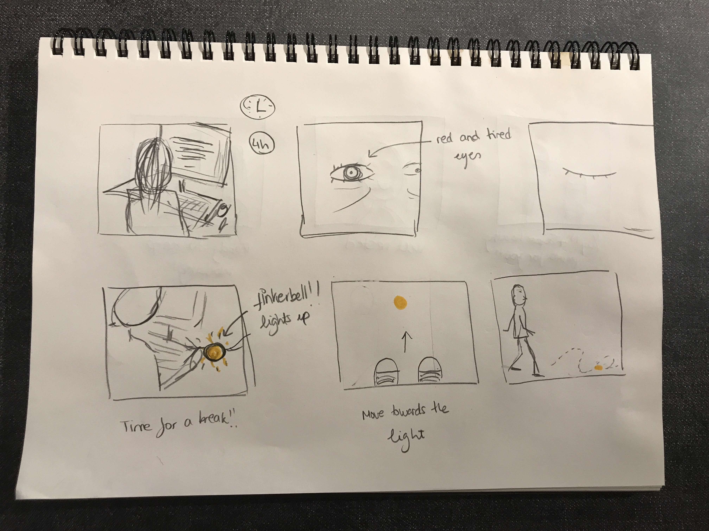
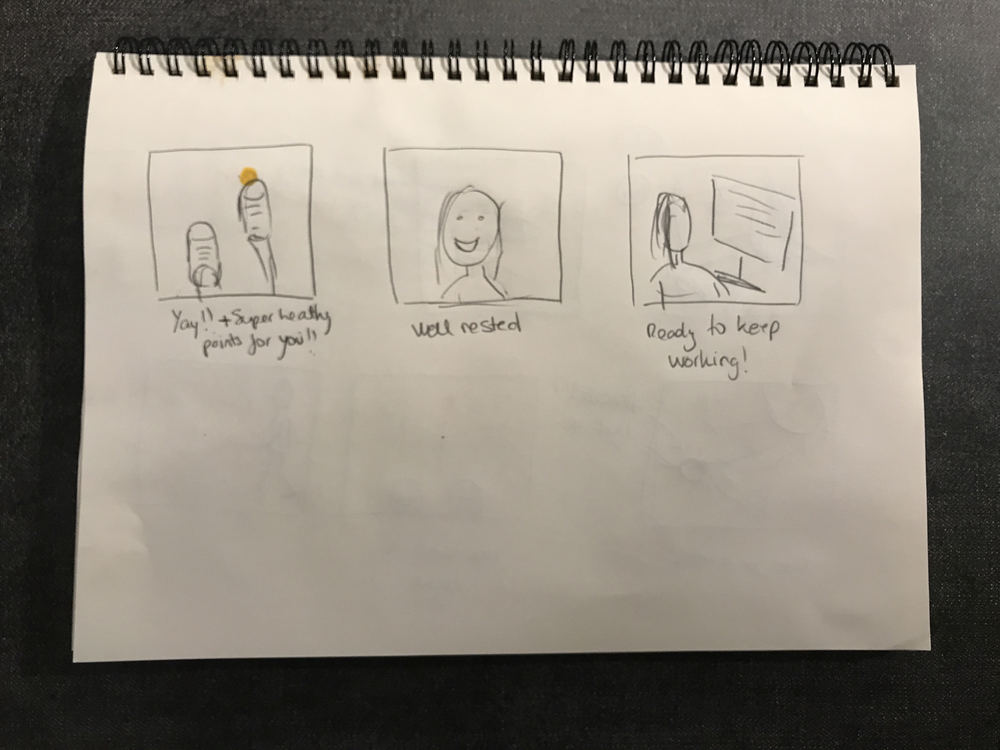
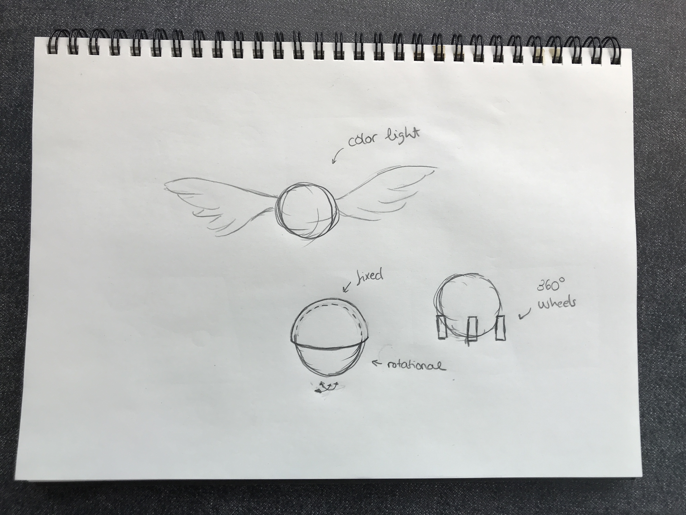
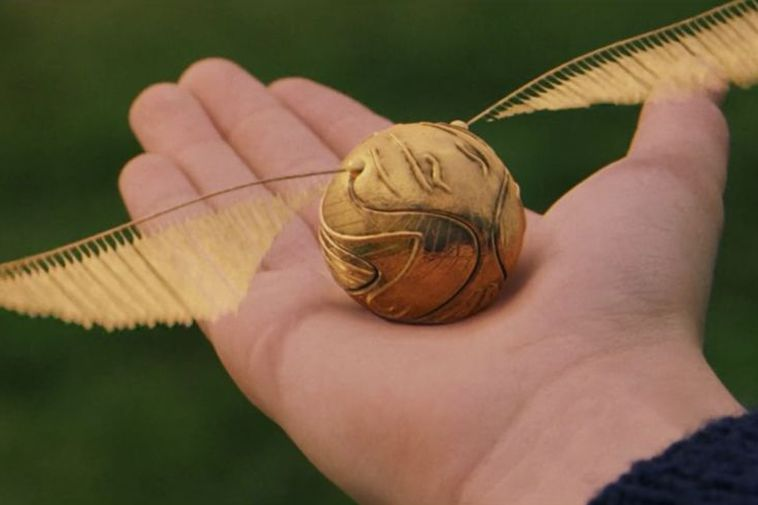
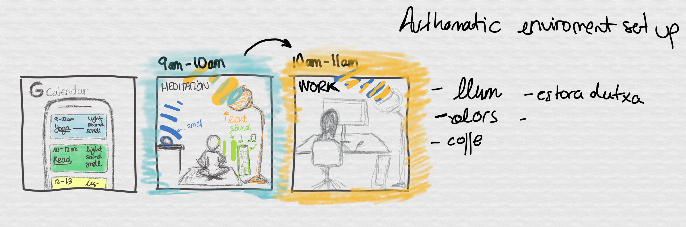

# Staging Interaction

In the original stage production of Peter Pan, Tinker Bell was represented by a darting light created by a small handheld mirror off-stage, reflecting a little circle of light from a powerful lamp. Tinkerbell communicates her presence through this light to the other characters. See more info [here](https://en.wikipedia.org/wiki/Tinker_Bell). 

There is no actor that plays Tinkerbell--her existence in the play comes from the interactions that the other characters have with her.

For lab this week, we draw on this and other inspirations from theatre to stage interactions with a device where the main mode of display/output for the interactive device you are designing is lighting. You will plot the interaction with a storyboard, and use your computer and a smartphone to experiment with what the interactions will look and feel like. _Make sure you read all the instructions and understand the whole of the laboratory activity before starting!_

## Prep

1. Set up [your Github "Lab Hub" repository](../../../) by [following these instructions](https://github.com/FAR-Lab/Developing-and-Designing-Interactive-Devices/blob/2021Spring/readings/Submitting%20Labs.md).
2. Set up the README.md for your Hub repository (for instance, so that it has your name and points to your own Lab 1) and [learn how](https://guides.github.com/features/mastering-markdown/) to post links to your submissions on your readme.md so we can find them easily.

### For lab, you will need:

1. Paper
1. Markers/ Pen
1. Smart Phone--Main required feature is that the phone needs to have a browser and display a webpage.
1. Computer--we will use your computer to host a webpage which also features controls
1. Found objects and materials--you’ll have to costume your phone so that it looks like some other device. These materials can include doll clothes, a paper lantern, a bottle, human clothes, a pillow case. Be creative!
1. Scissors

### Deliverables for this lab are: 
1. Storyboard
1. Sketches/photos of costumed device
1. Any reflections you have on the process.
1. Video sketch of the prototyped interaction.
1. Submit these in the lab1 folder of your class [Github page], either as links or uploaded files. Each group member should post their own copy of the work to their own Lab Hub, even if some of the work is the same for each person in the group.

## Overview
For this assignment, you are going to 

A) [Plan](#part-a-plan) 

B) [Act out the interaction](#part-b-act-out-the-interaction) 

C) [Prototype the device](#part-c-prototype-the-device)

D) [Wizard the device](#part-d-wizard-the-device) 

E) [Costume the device](#part-e-costume-the-device)

F) [Record the interaction](#part-f-record)

## The Report
This readme.md page in your own repository should be edited to include the work you have done. You can delete everything but the headers and the sections between the **stars**. Write the answers to the questions under the starred sentences. Include any material that explains what you did in this lab hub folder, and link it in the readme.

Labs are due on Mondays. Make sure this page is linked to on your main class hub page.

## Part A. Plan 

To stage the interaction with your interactive device, think about:

_Setting:_ Where is this interaction happening? (e.g., a jungle, the kitchen) When is it happening?

_Players:_ Who is involved in the interaction? Who else is there? If you reflect on the design of current day interactive devices like the Amazon Alexa, it’s clear they didn’t take into account people who had roommates, or the presence of children. Think through all the people who are in the setting.

_Activity:_ What is happening between the actors?

_Goals:_ What are the goals of each player? (e.g., jumping to a tree, opening the fridge). 

The interactive device can be anything *except* a computer, a tablet computer or a smart phone, but the main way it interacts needs to be using light.
- **Setting: Office space / room during quarantine.** 

- **Players: Just one individual working on school assignments in front of his/her computer for a long time**

- **Activity: In order to maintain his/her sanity, the individual needs small and frequent breaks to take his/her eyes out of the computer and move around the space. Tinker Bell is a small device that sits next to your computer and lights up when you have earned a little work pause. Then, Thinker Bell will invite you to move around the space (either by flying or with small wheels) by lighting up points on the floor of the room you should walk towards and touch. Everytime these small-goals are reached you will receive healthy super power points.**

- **Goal:  Quarantine is no fun, but we gotta move that body! The goal is to achieve a healthy work routine while in closed indoors for long periods of time and to be conscious of the importance of taking little breaks throughout our day**

Sketch a storyboard of the interactions you are planning. It does not need to be perfect, but must get across the behavior of the interactive device and the other characters in the scene. 
**Include a picture of your storyboard here**

Present your idea to the other people in your breakout room. You can just get feedback from one another or you can work together on the other parts of the lab.

**During our breakout rooms I presented different ideas to the team (Rui, Nicole, Brandt and Hortense). First I talked about a device which would help identify buildings in the Skyline of a city, so for example, when looking at NYC from the Empire States rooftop, Tinker Bell could help identify where the United Nations building is. This idea seemed creative to my peers but without a lot of value. Why would someone use this?. Next, I pitched how Tinker Bell could help people with dietary restrictions (eg. Gluten Free, Lactose Free) to find products that fit their needs in the supermarket. Imagine a Siri but able to give you spatial information as well. "Tinker Bell, show me where the Gluten Free Beer is''. Wouldn't that be cool? I would definitely save so much time! My team liked the idea and we started iterating on it. Hortense suggested that we could also use this product to find friends in crowded spaces, such as concerts. And indeed, I always lose my friends and can't find them within the crowds! One way people try to solve this problem is by carrying a high balloon around so friends can find them quick. But what if everyone brings balloons? Then the problem would not be solved. Tinker Bell could be an imaginative solution for that, but it would only work on dark spaces - during the day its light would hardly be visible. Other brainstorming ideas: Tinker Bell could be a nice drawing assistant. Whenever I am facing a white paper, Tinker Bell randomly projects light on the paper and helps me make my first brush strokes to get inspired.**

## Part B. Act out the Interaction

Try physically acting out the interaction you planned. For now, you can just pretend the device is doing the things you’ve scripted for it. 

**Are there things that seemed better on paper than acted out?**

**[VIDEO ACTING OUT THE INTERACTION](https://www.youtube.com/watch?v=Lp932oxmqAU&feature=youtu.be)**

**It certainly felt weird. I felt like a [puppy following a ball](https://www.youtube.com/watch?v=sdx2cV8GMQw) or like a cat running around trying to catch its own tail. To be fair, I believe I got inspired after I watched a video from Omer's (ECE'21) [cat enjoying himself chasing his tail](https://www.youtube.com/watch?v=9MR8Ym_H-80)(for privacy purposes, I am not linking Omer's video but a similar one).**

**Are there new ideas that occur to you or your collaborators that come up from the acting?**

**Some ideas that popped up: how about we gammify the experience making it a small competition among other people in quarantine as well? Tinker Bell could be linked to an app (maybe a partnership with Strava?) that would count your steps and goals and share these with your community. As a note, a [76 years old man ran a total of 17 km in his own house during lock down.](https://elpais.com/videos/2020-04-08/el-hombre-de-76-anos-que-corre-17-kilometros-en-casa-por-la-cuarentena.html)**

## Part C. Prototype the device

You will be using your smartphone as a stand-in for the device you are prototyping. You will use the browser of your smart phone to act as a “light” and use a remote control interface to remotely change the light on that device. 

Code for the "Tinkerbelle" tool, and instructions for setting up the server and your phone are [here](https://github.com/FAR-Lab/tinkerbelle).

We invented this tool for this lab! 
**Give us feedback on Tinkerbelle.**

**Simple, and creative tool to help in the prototyping process. It also provides some constraints which I believe are great to start an ideation process. However, depending on the desired interaction, the screen light may not be strong or directed enough for video purposes. The flash light on the back of the phone could be a good alternative. In any case, having the freedom to use whatever tool that can be controlled remotely to prototype our idea ends up giving us the creative freedom to explore whichever tool we believe will end up serving as a more successful prototype.**

## Part D. Wizard the device
Take a little time to set up the wizarding set-up that allows for someone to remotely control the device while someone acts with it. Hint: You can use Zoom to record videos, and you can pin someone’s video feed if that is the scene which you want to record. 

**Include your first attempts at recording the set-up video here.**
**[VIDEO WIZARDING THE DEVICE](https://www.youtube.com/watch?v=Lp932oxmqAU&feature=youtu.be) Note, I ended up using a phone controlled bulb.**

Now, hange the goal within the same setting, and update the interaction with the paper prototype. 

**Show the follow-up work here.**

## Part E. Costume the device

Only now should you start worrying about what the device should look like. Develop a costume so that you can use your phone as this device.

Think about the setting of the device: is the environment a place where the device could overheat? Is water a danger? Does it need to have bright colors in an emergency setting?

**Include sketches of what your device might look like here.**

**What concerns or opportunitities are influencing the way you've designed the device to look?**
**As you can see in the first drawing (top), I envision Tinker Bell as a flying light ball, similar to Harry Potters' Golden Snitch. However, Tinker Bell could also be a terrestrial device which can move in any X and Y direction. You can see the terrestrial version in the two drawings at the bottom**

## Part F. Record

**Take a video of your prototyped interaction.**

**[DEVICE Test Prototype](https://www.youtube.com/watch?v=7D1yjXatlpU&feature=youtu.be)**

**[VIDEO WIZARDING THE DEVICE](https://www.youtube.com/watch?v=Lp932oxmqAU&feature=youtu.be)**

**Please indicate anyone you collaborated with on this Lab.**
Be generous in acknowledging their contributions! And also recognizing any other influences (e.g. from YouTube, Github, Twitter) that informed your design.

**Lab Partners who gave me feedback: Brandt, Nicole, Rui, and Hortense**

**Camera and Bulb Controller: Andrew Dawson**

**Source of inspiration for my ideas: Harry Potter, Omer's Cat, [76 years old man ran a total of 17 km in his own house during lock down.](https://elpais.com/videos/2020-04-08/el-hombre-de-76-anos-que-corre-17-kilometros-en-casa-por-la-cuarentena.html)**

# Staging Interaction, Part 2 

This describes the second week's work for this lab activity.

## Prep (to be done before Lab on Wednesday)

You will be assigned three partners from another group. Go to their github pages, view their videos, and provide them with reactions, suggestions & feedback: explain to them what you saw happening in their video. Guess the scene and the goals of the character. Ask them about anything that wasn’t clear. 

**Summarize feedback from your partners here.**

Hortense:
"I love the idea of a snitch-type device! I think it would be great if it were something you could take outside the house and into public spaces, since houses can be small. If it is a rolling instead of flying device, you might consider it bumping into the chair on purpose to catch the user's attention."

Nicole:
"I like the idea especially I have spent so much time in front of the laptop all day every day. Sometimes, when I work, I forget to take a break so it can be helpful that the device sends out early warning. For instance, I start to move more frequently when I find it hard to focus or I start to yawn more."

Brandt:
"I actually do something very similar right where every 30 minutes or so I get up and walk around.  I don’t know how necessary it is to actually have the device move with the user.  For me personally I have found that the simple reminder is enough to get up.  One issues of having the device move around is that it runs the risk of causing injury, property damage or its own destruction.  Could it instead just light up and after a predetermined amount of time shut off indicating your break is over?"

Rui:
"Very cute idea! I liked the idea that Tinker bell could be like a Harry potter snitch that you can run around and chase. I think it would be interesting that when Tinker bell changed color, you would have to do a specific action. For example, when it is blue, you do 3 jumping jacks and when it is red you do three squats to make the activity more ‘active’ especially if the person using it is in a confined space and can’t move too much with Tinker Bell."

## Make it your own

Do last week’s assignment again, but this time: 
1) It doesn’t have to (just) use light, 
2) You can use any modality (e.g., vibration, sound) to prototype the behaviors, 
3) We will be grading with an emphasis on creativity. 

**Document everything here.**

Title: How to break the monotony of working and playing in a single space during the quarantine.

How can we use light, sound, and smell to transform physical space into completely different environments depending on the activity you need to perform. For everyone’s mental health it is important to separate work from play environments but, during quarantine everything mixes together, creating this only space where all activities are performed and suddenly it is hard to rest without thinking about work or work without thinking about rest.

As part of working towards a better work ethic during quarantine, I am trying to compartmentalize my day into different activities and change little things around me to make me feel like I am in a completely different space.

This proposal links my room light, my vaporizer, and my music to my Google Calendar and automatically sets my desired environment for each task so it is easier for my brain to say “now it is time to work” or “now is time to play”.

**Storyboard**

**[DEVICE Test Prototype](https://youtu.be/qfD7tY6eR0Y)**

Credit:

Lab Partners who gave me feedback: Brandt, Nicole, Rui, and Hortense

Camera and Bulb Controller: Andrew Dawson
