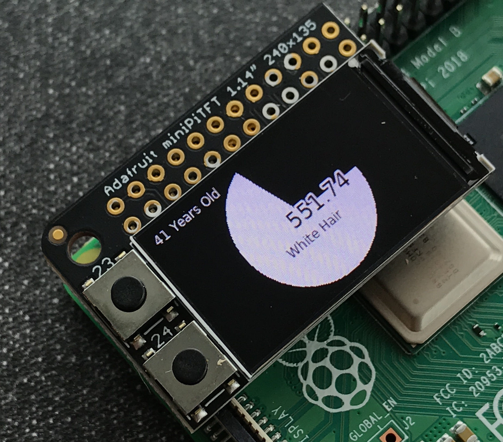
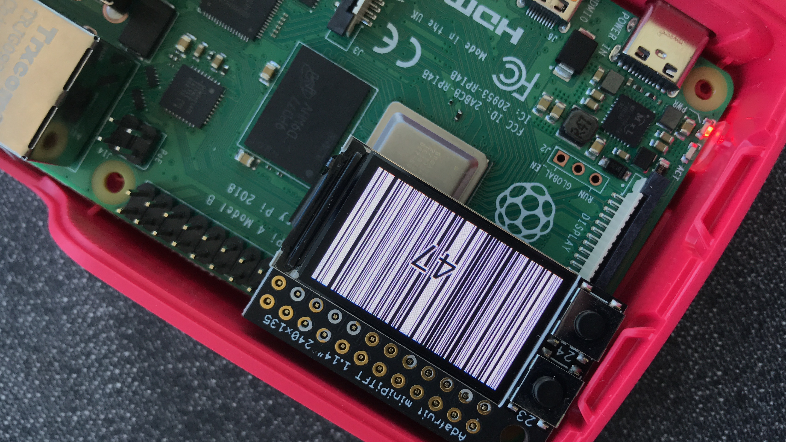
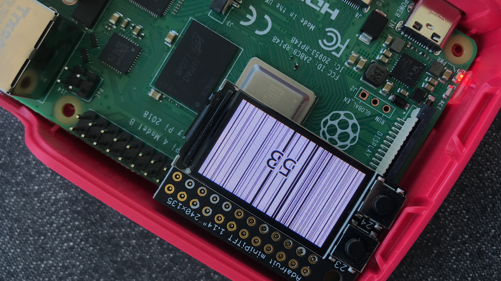
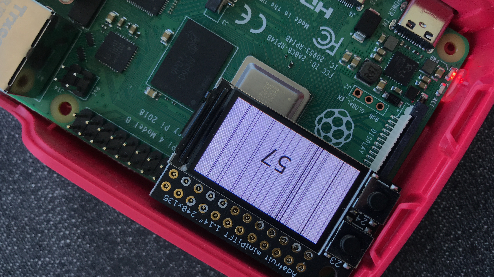

# The Clock of Pi

**Lab collaborators**: Brandt, Nicole, Rui, Hortense, and Antionio. Also huge thanks to Ilan and David - the TAs of this class - for helping with the Raspberry Pi setup**

## Prep ✅

[Lab prep](prep.md) 

### Get your kit ✅

### Set up your Lab 2 ✅

1. [Pull changes from the Interactive Lab Hub](https://github.com/FAR-Lab/Developing-and-Designing-Interactive-Devices/blob/2021Spring/readings/Submitting%20Labs.md#to-pull-lab-updates)

In terminal cd into your Interactive-Lab-Hub folder and run 

```
Interactive-Lab-Hub $ git remote add upstream https://github.com/FAR-Lab/Interactive-Lab-Hub.git
Interactive-Lab-Hub $ git pull upstream Spring2021
Interactive-Lab-Hub $ git add .
Interactive-Lab-Hub $ git commit -m'merge'
Interactive-Lab-Hub $ git push
```

Your local and remote should now be up to date with the most recent files.

2. Go to the [lab prep page](prep.md) to inventory your parts and set up your Pi.


## Overview

A) [Connect to your Pi](#part-a)  

B) [Try out cli_clock.py](#part-b) 

C) [Set up your RGB display](#part-c)

D) [Try out clock_display_demo](#part-d) 

E) [Modify the code to make the display your own](#part-e)

F) [Make a short video of your modified barebones PiClock](#part-f)

G) [Sketch and brainstorm further interactions and features you would like for your clock for Part 2.](#part-g)

## The Report

## Part A. ✅
## Connect to your Pi
Just like you did in the lab prep, ssh on to your pi. Once there create a Python environment.

```
ssh pi@ixe00
pi@ixe00:~ $ virtualenv circuitpython
pi@ixe00:~ $ source circuitpython/bin/activate
(circuitpython) pi@ixe00:~ $ 

```

## Part B. ✅
### Try out the Command Line Clock
Clone the repo for this assignment

```
(circuitpython) pi@ixe00:~$ git clone https://github.com/YOURGITID/Interactive-Lab-Hub.git
(circuitpython) pi@ixe00:~$ cd Interactive-Lab-Hub/Lab\ 2/
(circuitpython) pi@ixe00:~/Interactive-Lab-Hub $ 
```

Install the packages from the requirements.txt and run the example

```
(circuitpython) pi@ixe00:~/Interactive-Lab-Hub $ pip install -r requirements.txt
(circuitpython) pi@ixe00:~/Interactive-Lab-Hub/Lab 2 $ python cli_clock.py 
02/24/2021 11:20:49
```
you can press `ctrl-c` to exit.
If you're unfamiliar with the Python code in `cli_clock.py` have a look at [this Python refresher](https://hackernoon.com/intermediate-python-refresher-tutorial-project-ideas-and-tips-i28s320p). If you're still concerned, please reach out to the teaching staff!


## Part C. ✅
## Set up your RGB Display
We will introduce you to the [Adafruit MiniPiTFT](https://www.adafruit.com/product/4393) and Python on the Pi.


The Raspberry Pi 4 has a variety of interfacing options. When you plug the pi in the red power LED turns on. Any time the SD card is accessed the green LED flashes. It has standard USB ports and HDMI ports. Less familiar it has a set of 20x2 pin headers that allow you to connect a various peripherals.


To learn more about any individual pin and what it is for go to [pinout.xyz](https://pinout.xyz/pinout/3v3_power) and click on the pin. Some terms may be unfamiliar but we will go over the relevant ones as they come up.

### Hardware

From your kit take out the display and the [Raspberry Pi 4](https://www.adafruit.com/product/4296 | width=200)

Line up the screen and press it on the headers. The hole in the screen should match up with the hole on the raspberry pi.

<p float="left">


</p>

#### Testing your Screen

The display uses a communication protocol called [SPI](https://www.circuitbasics.com/basics-of-the-spi-communication-protocol/) to speak with the raspberry pi. We won't go in depth in this course over how SPI works. The port on the bottom of the display connects to the SDA and SCL pins used for the I2C communication protocol which we will cover later. GPIO (General Purpose Input/Output) pins 23 and 24 are connected to the two buttons on the left. GPIO 22 controls the display backlight.

We can test it by typing 
```
python screen_test.py
```

You can type the name of a color then press either of the buttons to see what happens on the display. Take a look at the code with
```
cat screen_test.py
```

#### Displaying Info
You can look in `stats.py` for how to display text on the screen

#### Displaying an image

You can look in `image.py` for an example of how to display an image on the screen. Can you make it switch to another image when you push one of the buttons?

**[Code - Part C](image_mod.py)**

<p float="left">


</p>

## Part D. ✅
## Set up the Display Clock Demo

In `screen_clock.py`. Show the time by filling in the while loop. You can use the code in `cli_clock.py` and `stats.py` to figure this out.

**[Code - Part D](screen_clock.py)**

<p float="left">
  
  
</p>


## Part E. ✅
## Modify the barebones clock to make it your own

**[Code - Part E](screen_clock_creative.py)**
You can push to your personal github repo by adding the files here, commiting and pushing.

## Part F. ✅
## CLICK 🖱 on the images ⬇️ to watch the 🎞

<p float="left">
  <a href="https://youtu.be/EMdXMbvFAaU">
    
  </a>
  <a href="https://youtu.be/2du6wYEes10">
    
  </a>
</p>
After that, git will ask you to login to your github account to upload.

## Part G. ✅
## Sketch and brainstorm further interactions and features you would like for your clock for Part 2.

## CLICK 🖱 on the images ⬇️ to watch the 🎞

<p float="left">
  <a href="https://www.youtube.com/watch?v=CPGgmZUfePE&feature=youtu.be">
    
  </a>
  
</p>
Image Source: https://www.medicalnewstoday.com/articles/320288


**Other Ideas:**

- number of white hair
- number of socks being used in a life time
- number of people reading the NYT (there are supposed to be more ppl reading the newspaper in the morning that at night) -- is this an old fashion idea?
- number of friends on LinkedIn
- data usage during the day
- number of Twitts per second world wide 


## Prep for Part 2

1. Pick up remaining parts for kit.

2. Look at and give feedback on the Part G. for at least 2 other people in the class (and get 2 people to comment on your Part G!)

# Lab 2 Part 2

Pull Interactive Lab Hub updates to your repo.

Modify the code from last week's lab to make a new visual interface for your new clock. You may [extend the Pi](Extending%20the%20Pi.md) by adding sensors or buttons, but this is not required.

As always, make sure you document contributions and ideas from others explicitly in your writeup.

You are permitted (but not required) to work in groups and share a turn in; you are expected to make equal contribution on any group work you do, and N people's group project should look like N times the work of a single person's lab. What each person did should be explicitly documented. Make sure the page for the group turn in is linked to your Interactive Lab Hub page. 

Click at the images to play the video! ⬇️👐🏼🎥

<p float="left">
  <a href="https://youtu.be/EPxKXfEFq0M">
    
  </a>
  <a href="https://youtu.be/EPxKXfEFq0M">
    
  </a>
   <a href="https://youtu.be/EPxKXfEFq0M">
    
  </a>
   <a href="https://youtu.be/EPxKXfEFq0M">
    
  </a>
</p>

