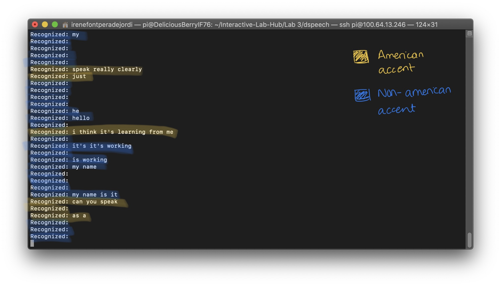
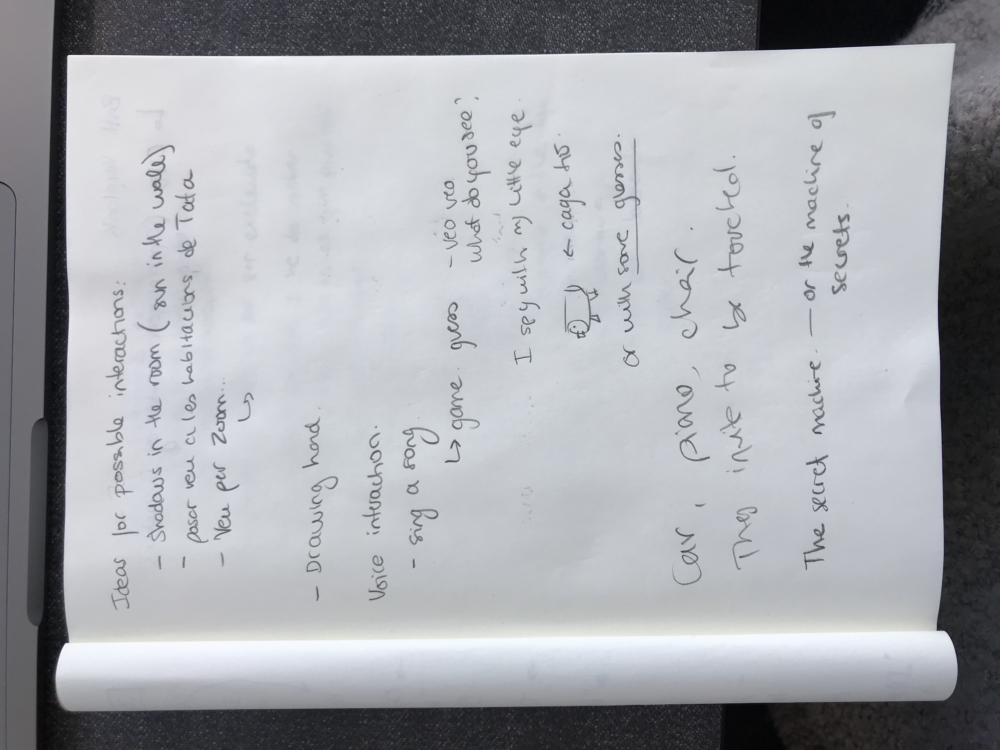
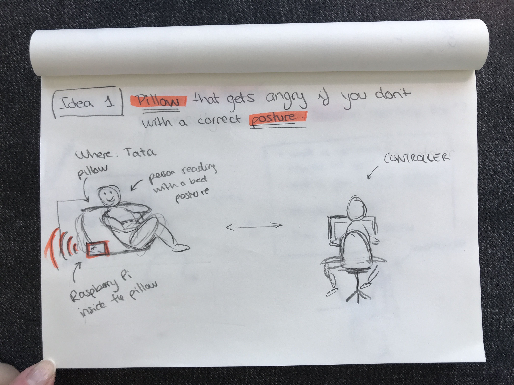
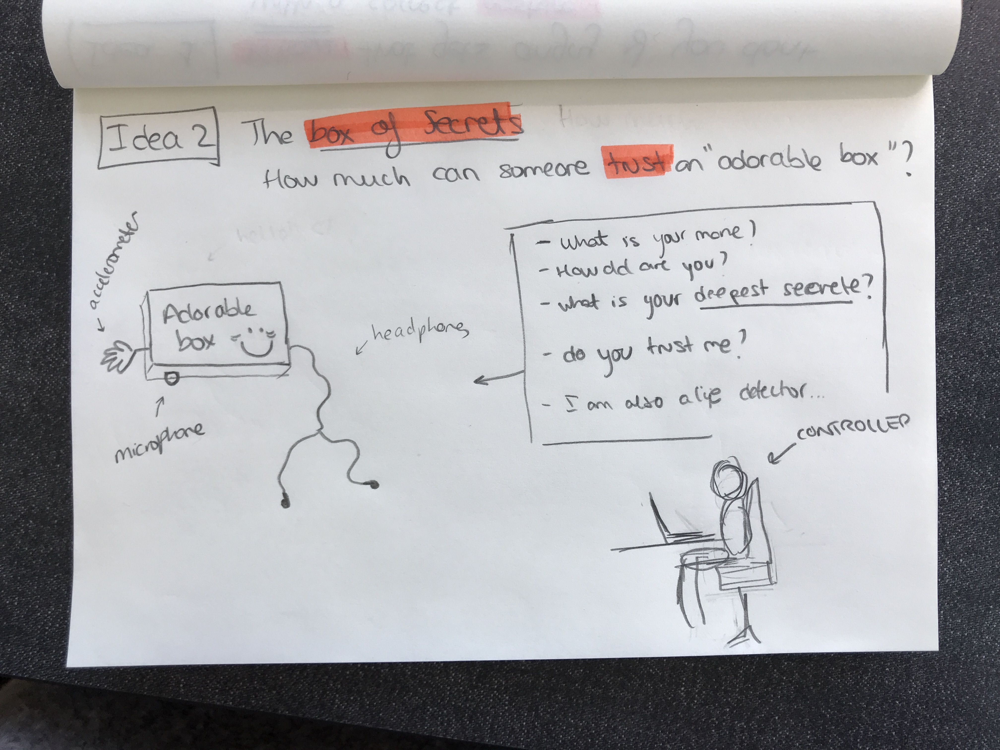
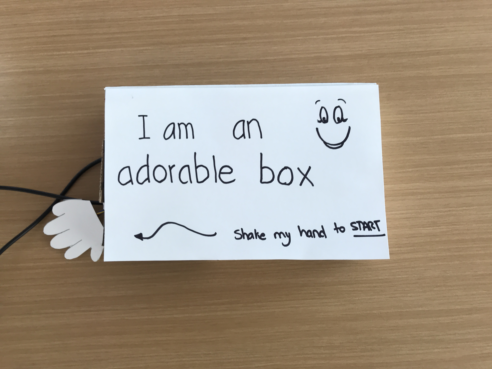
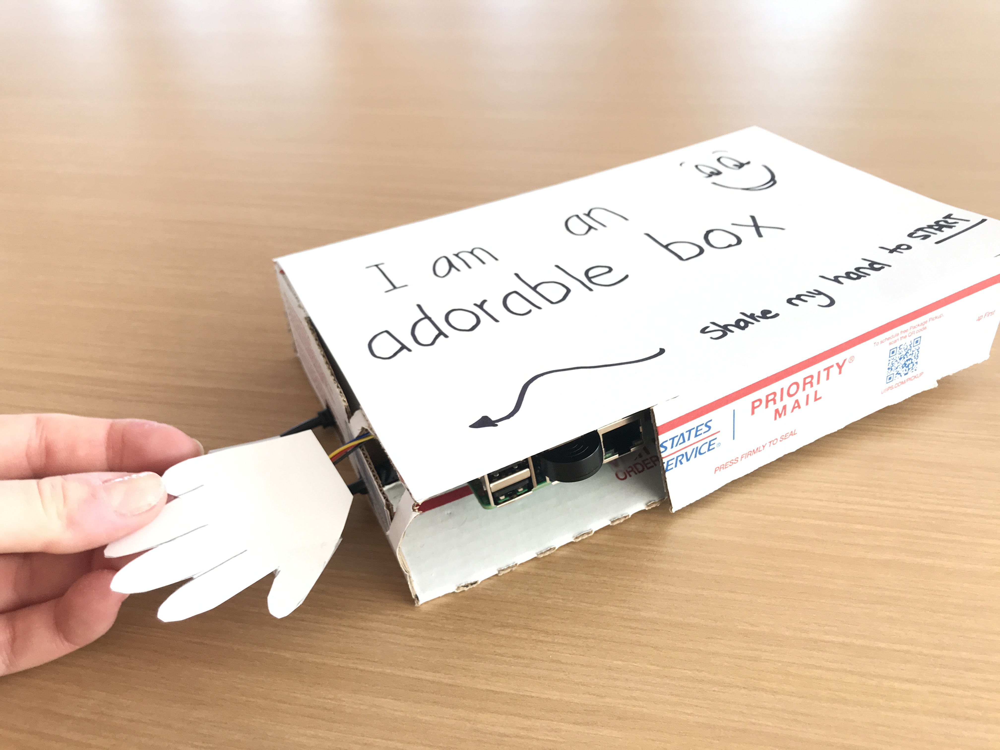
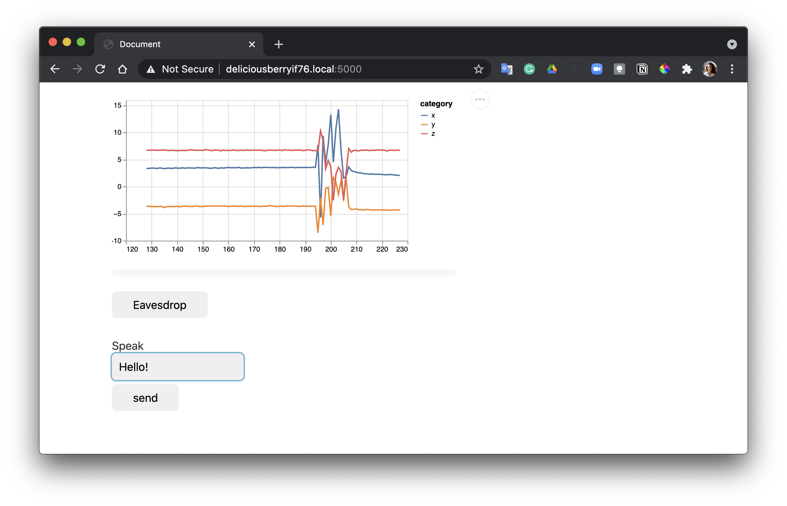

# You're a wizard, Irene 💡

## Text to Speech and Speech to Text ✅

In the home directory of your Pi there is a folder called `text2speech` containing some shell scripts.

```
pi@ixe00:~/text2speech $ ls
Download        festival_demo.sh  GoogleTTS_demo.sh  pico2text_demo.sh
espeak_demo.sh  flite_demo.sh     lookdave.wav

```

you can run these examples by typing 
`./espeakdeom.sh`. Take some time to look at each script and see how it works. You can see a script by typing `cat filename`

```
pi@ixe00:~/text2speech $ cat festival_demo.sh 
#from: https://elinux.org/RPi_Text_to_Speech_(Speech_Synthesis)#Festival_Text_to_Speech

echo "Just what do you think you're doing, Dave?" | festival --tts

```

You can also play audio files directly with `aplay filename`.

After looking through this folder do the same for the `speech2text` folder. In particular, look at `test_words.py` and make sure you understand how the vocab is defined. Then try `./vosk_demo_mic.sh`

## Serving Pages ✅

In Lab 1 we served a webpage with flask. In this lab you may find it useful to serve a webpage for the controller on a remote device. Here is a simple example of a webserver.

```
pi@ixe00:~/$ python server.py
 * Serving Flask app "server" (lazy loading)
 * Environment: production
   WARNING: This is a development server. Do not use it in a production deployment.
   Use a production WSGI server instead.
 * Debug mode: on
 * Running on http://0.0.0.0:5000/ (Press CTRL+C to quit)
 * Restarting with stat
 * Debugger is active!
 * Debugger PIN: 162-573-883
```
From a remote browser on the same network, check to make sure your webserver is working by going to [http://ixe00.local:5000]()


## Demo ✅

In the [demo directory](./demo), you will find an example wizard of oz project you may use as a template. **You do not have to** feel free to get creative. In that project, you can see how audio and sensor data is streamed from the Pi to a wizard controller that runs in the browser. You can control what system says from the controller as well.

## Optional ✅

There is an included [dspeech](.dspeech) demo that uses [Mozilla DeepSpeech](https://github.com/mozilla/DeepSpeech) for speech to text. If you're interested in trying it out we suggest you create a seperarate virutalenv. 

<p float="left">
    
</p>

Testing DeepSpeech with Rui over Zoom. She has an American Accent and I don't. ⬆️ This is the result. 

Mmmmm clearly, **the model has been trained using American accents!!!** Look how poorly it performed when I (non-native) spoke to it... ! (Should I be worried?) ❓

# Lab 3 Part 2 
# How much can you trust an Adorable Box? ❓❔

## Prep for Part 2

#### 1. Brainstorming

<p float="left">
    
</p>

#### 2. Two ideas!
<p float="left">
    
   
</p>

## Share your idea sketches with Zoom Room mates and get feedback

*Feedback from Brandt, Rui, Hortense, and Nicole*

The team liked both ideas, they thought both of them were fun interactions as well as had a purpose. 
For instance, in the first idea, the subject was told if their posture was incorrect and it would be interesting what is their reaction to the feedback. Would they correct the posture and thank the pillow for the reminder, or would they do the opposite, and change pillows to sit however they want without getting yelled at? Is the pillow an annoying parent or a nice partner? 

In the second idea, my Zoom partners agree that there is a much more deep psychological component, which I liked. In this case, we have a box that is supposed to be very nice and "adorable", and we want to know to what extent the user will trust the box telling it their deepest secrets. 


## Prototype your system

<p float="left">
    
    
</p>

#### How does the system work?


<p float="left">
    
    
</p>

The system is in itself quite simple! The Raspberry Pi is hidden inside of a box. The box has some holes for the accelerometer, the power supply, and the headphones. The accelerometer is hidden using a paper hand, that the user needs to shake to start the interaction.

The box would start saying: 

- *Hi! I am the box of secrets.*

Then, it would start asking some worm up questions like:

- *What is your name?*
- *How old are you?*
- *Where do you live?*
- *What do you enjoy doing on the weekends?*

Next, it would start asking some personal and uncomfortable questions, testing how far the user was willing to go.

- *How many sexual partners have you had?*
- *What position is your favorite?*
- *Who are you attracted to at Cornell Tech?*

Sometimes, if I was detecting the user was telling a lie, the box would respond something like:

- *Do you know I am also a lie detector?*

In the end, I would finish the experiment by saying this sentence:

- *Thank you for answering the questions! This is a small experiment to see how far people feel comfortable sharing personal questions with a box.*


## Test the system

<p float="left">
    
</p>

Subject shaking the "adorable box"'s hand

<p float="left">
    
    
</p>

In the first gif, the subject is being asked the first uncomfortable question --> *How many sexual partners have you had?*

In the second gif, the subject has already been asked 3 uncomfortable questions and he scratching his neck. 


### What worked well about the system and what didn't?

The system worked surprisinginly as expected. Users were able to shake the box's hand (accelerometer) to start the interaction. They could speak into the microphone and they could hear whatever I was typing in the back. 

One thing which did not work well and both users pointed out is the voice design. The first user mentioned that he had a hard time trusting the box since the voice was not human at all. "The meaning of the words is enthusiastic, but the tone is not at all". This contrast made the user confused and the box not trustworthy. 

Next, in the second test, when writing "How old are you" the user would hear "How are you?". This is again, probably due to the expressive limitations of the voice used.

### What worked well about the controller and what didn't?

The controller seems to be working very nicely. The biggest problem was the delays. 
In the first iteration, I spend quite some time thinking and then typing what I wanted the box to say, which may have made the interaction a bit awkward. In the second iteration, I had some sentences prepared, so I could just copy and paste whatever I wanted to say next. In this case, the delay was significantly reduced but the conversation was not as natural since most of the time I would keep questioning the user instead of answering his follow up questions.

### What lessons can you take away from the WoZ interactions for designing a more autonomous version of the system

Since this is more of an experiment than a functional object, I would iterate on three elements that influence people's trust in the object (they are written by order of priority):
- The voice's tone
- The questions that are being asked and their order
- The delays

### How could you use your system to create a dataset of interaction? What other sensing modalities would make sense to capture?

It would be nice to measure the heart rate as well, to see how this one increases when certain questions are being asked. 
Regarding the dataset, I think this experiment can help collect more qualitative than quantitative measurements. For instance, gathering the reactions I got from the second participant, like an extreme laugh or touching the neck when they are nervous.

