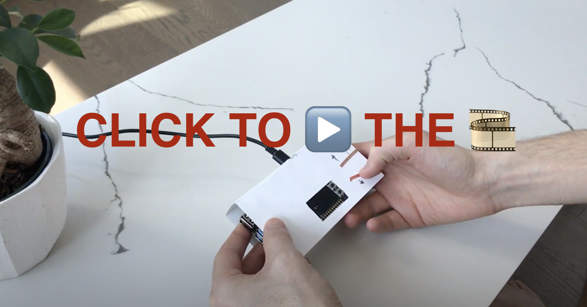
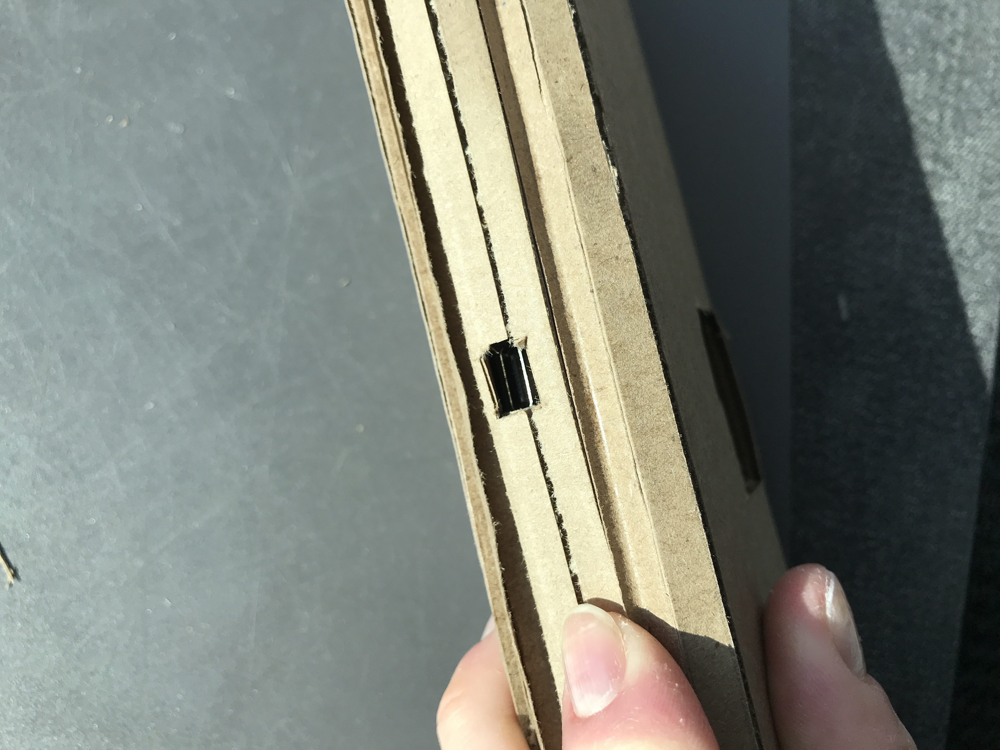

# Ph-UI!!!

-------------

<p float="center">
  
  
</p>

-------------

## ✅ Prep 

Readings: 

* [What do prototypes prototype?](https://www.semanticscholar.org/paper/What-do-Prototypes-Prototype-Houde-Hill/30bc6125fab9d9b2d5854223aeea7900a218f149)
* [Paper prototyping](https://www.uxpin.com/studio/blog/paper-prototyping-the-practical-beginners-guide/) 
* [Cardboard prototypes](https://www.youtube.com/watch?v=k_9Q-KDSb9o)
* [Tips to Cut, Fold, Mold and Papier-Mache Cardboard](https://makezine.com/2016/04/21/working-with-cardboard-tips-cut-fold-mold-papier-mache/)
* [Surprisingly complicated forms](https://www.pinterest.com/pin/50032245843343100/)
* [Cardboard mechanisms](https://www.pinterest.com/helgangchin/paper-mechanisms/) 

### For lab, you will need:

1. Cardboard (start collecting those shipping boxes!)
1. Cutting board
1. Cutting tools
1. Markers
1. Found objects and materials--like bananas--we're not saying that to be funny.


### Deliverables for this lab are: 
1. Sketches/photos of device designs
1. "Looks like" prototypes: show us what how the device should look, feel, sit, weigh, etc.
3. "Works like" prototypes: show us what the device can do
4. "Acts like" prototypes: videos/storyboards/other means of showing how a person would interact with the device
5. Submit these in the lab 4 folder of your class [Github page], either as links or uploaded files. Each group member should post their own copy of the work to their own Lab Hub, even if some of the work is the same for each person in the group.


## Overview
Here are the parts of the assignment

A) [Capacitive Sensing](#part-a)

B) [OLED screen](#part-b) 

C) [Paper Display](#part-c)

D) [Wizard the device](#part-d-wizard-the-device) 

E) [Costume the device](#part-e-costume-the-device)

F) [Record the interaction](#part-f-record)

# The Report - Part 1

## ✅ Part A
### Capacitive Sensing, a.k.a. Human Banana Interaction

We wanted to introduce you to the [capacitive sensor](https://learn.adafruit.com/adafruit-mpr121-gator) in your kit. It's one of the most flexible input devices we were able to provide. At boot it measures the capacitance on each of the 12 contacts. Whenever that capacitance changes it considers it a user touch. You can attach any conductive material. In your kit you have conductive fabric and copper tape that will work well, but don't limit yourself! In this lab we will use (go?) bananas!

<p float="left">


</p>

Plug in the capacitive sensor board with the qwiic connector. Connect your banana's with either the copper tape or the alligator clips (the clips work better). make sure to install the requirements from `requirements.txt`

```
(circuitpython) pi@ixe00:~/Interactive-Lab-Hub/Lab 4 $ python cap_test.py 
Banana 10 touched!
Banana 6 touched!
```

## ❎ Part B
### OLED screen

Unfortunately, since the campus closed, I could not get my OLED Screen :(

We just received some of the small oled screens that we had coped to include in your kit. If you want one feel free to pop into the lab and get one. These don't have colors like the one on the pi but you can move it around on a cable making for more flexible interface design. The way you program this display is almost identical to the pi display. Take a look at `oled_test.py` and some more of the [Adafruit examples](https://github.com/adafruit/Adafruit_CircuitPython_SSD1306/tree/master/examples).


## ✅ Brainstorming (new section)

##### Inspirational Links:

The capacitive sensor offers endless possibilities! And think about it combined with other sensors, like my new recently discovered gesture recognition. Before starting my creation process I did a round of research. Here the websites and porjects I like the most:


- [Raphaël Pluvinage](https://vimeo.com/user3131794) → A big source of inspiration has been this website! I truly recommend you look at it. 

<p float="left">

</p>

- ["XOXX Composer"](https://www.pinterest.com.mx/pin/804948133376198819/) by Axel Bluhme 

<p float="left">

</p>

##### My ideas:

- “Learn how to pronounce words / Learn another language!” game for kids. By touching a certain word, the Pi would pronounce it out loud and the kid would need to repeat it. 


- “Find the pairs! Touch different elements around and uncover their hidden patterns” game. Some elements around would have a hidden pattern, and these patterns are displayed for 1 second in the Pi screen when touching them. You would need to touch different elements in the space you are around and find the patterns that match. 


- “What sound do plants make?” My idea was to attach different plant leaves into a round and conductive surface, in a way that the leaves did have some room to move depending on the wind currents. Then, attach some conductive material behind the leaves so whenever the leaves move with the wind and touch the surface, a sound would be heard!


- “Camera with heat” I still want to do this one!! How can I use [heat-sensitive fabric](https://www.alibaba.com/product-detail/High-quality-heat-sensitive-color-changing_1600086710813.html) or [heat-sensitive paint](https://www.amazon.com/thermochromic-paint/s?k=thermochromic+paint) and this [pin art game](https://www.amazon.com/Rhode-Island-Novelty-Point-Impressions/dp/B002MUYTMG/ref=asc_df_B002MUYTMG/?tag=hyprod-20&linkCode=df0&hvadid=309875729163&hvpos=&hvnetw=g&hvrand=1954434514155065801&hvpone=&hvptwo=&hvqmt=&hvdev=c&hvdvcmdl=&hvlocint=&hvlocphy=9067609&hvtargid=pla-568944846160&psc=1&tag=&ref=&adgrpid=65715448310&hvpone=&hvptwo=&hvadid=309875729163&hvpos=&hvnetw=g&hvrand=1954434514155065801&hvqmt=&hvdev=c&hvdvcmdl=&hvlocint=&hvlocphy=9067609&hvtargid=pla-568944846160) to create pictures? Ideally, I would use the Pi camera to translate the light intensity for each pixel to heat. This heat would be applied to the corresponding pins in the pin art surface, and these would transmit the heat to the fabric. 


- Simon says - I loved that game!


- A Mancala game but with touch.


- Tetris!


- Snake! (my final choice). How can I play the snake game using the movement that BMW (the car brand) popularized, **creating what has been named as the best advertisement in history. [Te gusta conducir?](https://images.app.goo.gl/3D1GHZzfAH8m9S3dA)**


## ✅ Part C
### Paper Display

**a. Document the design for your paper display.** 

I started without much knowledge about the Pi measurements and was just constrained by the length of the paper I had. I randomly decided to divide the paper into 7 and 3 centimeters pieces, so it would be a rectangular box where the Pi could fit, and then, there would be enough room for other sensors.  

The first problem I ran into was that the Pi fell from one side to the other too easily, making it difficult to define the whole where the screen should be. To solve this fast, I put extra pieces of cardboard in both the bottom and the back of the inner box (refer to the images). This was not the best solution but it worked for the first prototype, and more importantly, it informed my second prototype, which I will talk about later.


<p float="left">
  
  
  
  
</p>

**b. Make a video of your paper display in action.**

<p float="left">
  <a href="https://youtu.be/46x7nXnIvT0">
    
   </a>
</p>


**c. Explain the rationale for the design.**

For this first iteration, I wanted the prototype to be holdable with two hands and playable with the right hand thumb. As you can see in the video, I believe the prototype satisfied the goal. 

Observing the participant play made me think about **other possible ways the user could interact** with the Snake other than just touching a 2D surface up and down to make it move. And this is when I thought about the “Te gusta conducir?” advertisement from BMW. They show how enjoyable it is to ride your car with your hand outside the window, feeling the wind and as if your hand was the one actually controlling the movement. Then, the Snake game is a driving game after all. The Snake is an object trying to reach their goal by moving up and down. 

### ✅ Part D
### Materiality

**Open Ended**: We are putting very few constraints on this part but we want you to get creative.

Design a system with the Pi and anything from your kit with a focus on form, and materiality. The "stuff" that enclose the system should be informed by the desired interaction.

**a. Document the material prototype.** 

After having played around the first prototype, these two models you can see in the sketches were considered. All of them address the question, how can the user better interact with the snake or what is the best experience we can create for the user to give the instructions to the Snake on how to achieve the goal: to reach the yellow brick. 

<p float="left">
  
</p>

The sketch 1 shows a pulling system with 4 allowed directions. This is cool, but to make this feasible the user should have both hands free. Where would this box be? Would it be hanging on a wall? This could solve the problem. 

The sketch 2 shows a touching system with 8, 6, or 4 allowed directions. Here we still have the same problem. The box needs to be held by a side, or otherwise, it needs to be held by something else. Maybe using pressure sensors instead of touch sensors would solve this problem.  


**b. Explain the selection.**

These are two ideas that were considered but not the chosen one. As mentioned previously, I really liked the idea of **using the whole arm movement as an indicator of where the Snake should turn towards**, as if your arm was the Snake. We will see later in the videos who this turned out! 

# Part 2

**How do I want the interaction experience to feel like:**

I started part 2 with a constant: I want the users when they play the Snake to experience the same feeling as the drivers experience when they put their left hand outside the window.


**How should it work:**

Next, I started making some drawings of what I was envisioning. You can see them here:

<p float="left">
  
  
</p>

First, I started looking at how I want the Snake to move, and how many directions do I give the user to play with. As you saw in my first prototype I was thinking about 4 different directions (up, down, left, right). But when we think about the BMW add (again) the simpler the movement the better to be able to focus on enjoying the experience rather than making sure you are doing the most accurate movements as possible.


Then, I settled down into two movements, up and down, so the Snake will automatically always move forward and the goal will always be on the opposite end. The Snake starts on the left of the screen in a random y axis point. The goal pixel is always on the right side, positioned in a random y axis point. The user can move their hand up and down to move the Snake in a way that every time their hand touches the upper bound surface the Snake will move up, and the inverse will happen when the lower bound surface is touched. 


The Snake starts being very small (5x5 px), but every time the Snake reaches the goal, its length grows and the game restarts again. On the contrary, if the user fails to reach the goal, the game restarts and the Snake’s will be small again. You can see the lengths changing in the previous prototype:

<p float="left">
  
  
</p>
 
Another interaction I initially added was that once the user has the Snake positioned in the right place, it can make the Snake run faster by bringing their hands forward. At the end, I did not include it in the final video since the sensor was not sensitive enough to work as I had planned it to.

**How should it look like:**

Thinking as if the arm was the Snake, and the arm movement would indicate the Snakes movement, how should our prototype be designed? I started thinking about a rectangular box filled with conductive sensors and with one side off from which you could put your arm in. By touching the inner surfaces you could indicate the movement of the Snake. 

Then, I thought that there is really no need to have more than two touching surfaces. We could make this surface a cylinder instead of a closed box. And this is the ring of my trash can is the closest material I could find that is big enough for the hand to move up and down freely.

<p float="left">
  
  
  
</p>

**How should it act as?**

<p float="left">
  <a href="https://youtu.be/58FqU577yEU">
    
  </a>
  <a href="https://youtu.be/0gEFR_L_dg4">  
    
  </a>
  <a href="https://youtu.be/OG3JeGbf000">
    
  </a>
</p>


