# Observant Systems

## Overview
Building upon the paper-airplane metaphor (we're understanding the material of machine learning for design), here are the four sections of the lab activity:

A) [Play](#part-a)

B) [Fold](#part-b)

C) [Flight test](#part-c)

D) [Reflect](#part-d)


Two ideas:
### 1. Playing to be God 
In my personal Instagram I have a channel called Playing to be God. In it, I typically upload videos recorded with my phone, and while my right hand holds the phone, my left hand appears in the video, playing with the screen somehow. I usually make some sounds as sound effects of what is going on. My idea was to use the Pi camera to capture these interactions and make sounds when my hand collapses with a person. Find a sketch attached. 
After trying several scripts (you can find the last version of it in the 'PlayingToBeGod' folder), I realized that the latency makes my game almost impossible, and if possible it would probably make no sense. So I pivoted towards my next idea: Measuring Art Engagement in galeries. 

<p float="left">
    
</p>


### 2. Measuring Art Engagement - The winner :)

My second idea is about measuring the connection between art visitors and pieces of art in a museum. The goal is to uncover or quantify the time a user spends looking a piece of art, and compare to extract potential patterns. Ideally we could use biometrics data to understand what the users are feeling about certain pieces of art and understand the connection or engagement levels between these to actors. In this case, I have simplified the problem by calculating the time each user spends looking at different pieces of art. To do so, I have used a Teachable Machine. Please, find an early sketch of my idea:


<p float="left">
    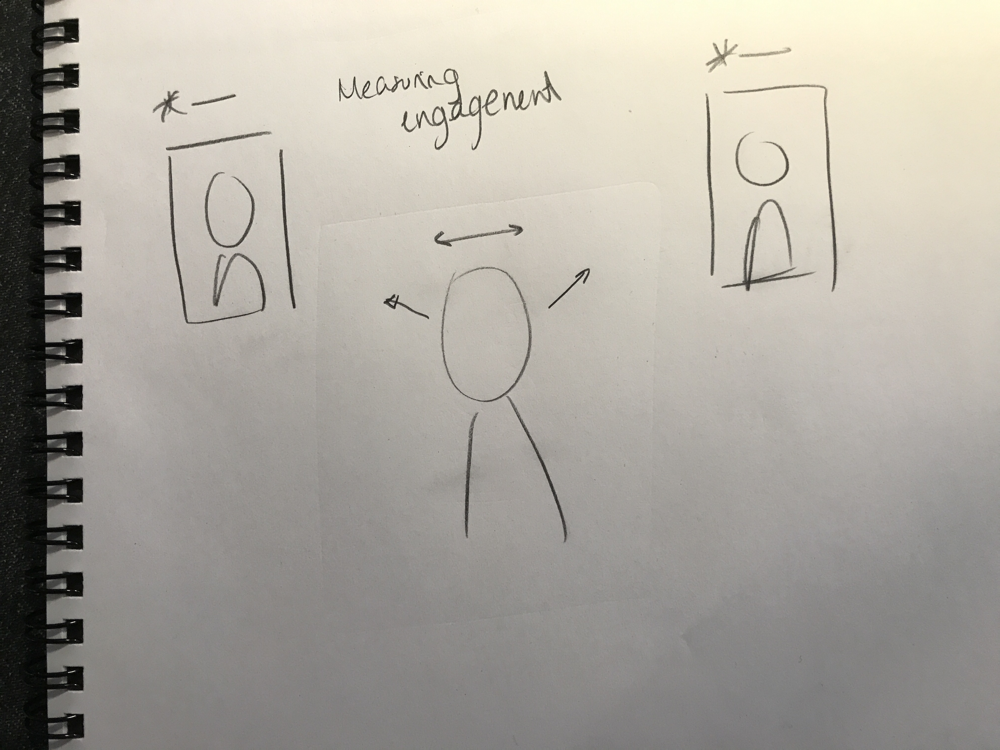
</p>


---
## ✅ Part A
### Play with different sense-making algorithms.
##### OpenCV
A more traditional to extract information out of images is provided with OpenCV. The RPI image provided to you comes with an optimized installation that can be accessed through python.

Additionally, we also included 4 standard OpenCV examples. These examples include contour(blob) detection, face detection with the ``Haarcascade``, flow detection(a type of keypoint tracking), and standard object detection with the [Yolo](https://pjreddie.com/darknet/yolo/) darknet.

Most examples can be run with a screen (I.e. VNC or ssh -X or with an HDMI monitor), or with just the terminal. The examples are separated out into different folders. Each folder contains a ```HowToUse.md``` file, which explains how to run the python example.

```shell
pi@ixe00:~/openCV-examples $ tree -l
.
├── contours-detection
│   ├── contours.py
│   └── HowToUse.md
├── data
│   ├── slow_traffic_small.mp4
│   └── test.jpg
├── face-detection
│   ├── face-detection.py
│   ├── faces_detected.jpg
│   ├── haarcascade_eye_tree_eyeglasses.xml
│   ├── haarcascade_eye.xml
│   ├── haarcascade_frontalface_alt.xml
│   ├── haarcascade_frontalface_default.xml
│   └── HowToUse.md
├── flow-detection
│   ├── flow.png
│   ├── HowToUse.md
│   └── optical_flow.py
└── object-detection
    ├── detected_out.jpg
    ├── detect.py
    ├── frozen_inference_graph.pb
    ├── HowToUse.md
    └── ssd_mobilenet_v2_coco_2018_03_29.pbtxt
```

#### Teachable Machines (beta, optional)
Google's [TeachableMachines](https://teachablemachine.withgoogle.com/train) might look very simple.  However, its simplicity is very useful for experimenting with the capabilities of this technology.

You can train a Model on your browser, experiment with its performance, and then port it to the Raspberry Pi to do even its task on the device.

Here is Adafruit's directions on using Raspberry Pi and the Pi camera with Teachable Machines:

1. [Setup](https://learn.adafruit.com/teachable-machine-raspberry-pi-tensorflow-camera/raspberry-pi-setup)
2. Install Tensorflow: Like [this](https://learn.adafruit.com/running-tensorflow-lite-on-the-raspberry-pi-4/tensorflow-lite-2-setup), but use this [pre-built binary](https://github.com/bitsy-ai/tensorflow-arm-bin/) [the file](https://github.com/bitsy-ai/tensorflow-arm-bin/releases/download/v2.4.0/tensorflow-2.4.0-cp37-none-linux_armv7l.whl) for Tensorflow, it will speed things up a lot.
3. [Collect data and train models using the PiCam](https://learn.adafruit.com/teachable-machine-raspberry-pi-tensorflow-camera/training)
4. [Export and run trained models on the Pi](https://learn.adafruit.com/teachable-machine-raspberry-pi-tensorflow-camera/transferring-to-the-pi)

Alternative less steps option is [here](https://github.com/FAR-Lab/TensorflowonThePi).

---
## ✅ Part B
### Construct a simple interaction.

Pick one of the models you have tried, pick a class of objects, and experiment with prototyping an interaction.
This can be as simple as the boat detector earlier.
Try out different interactions outputs and inputs.
**Describe and detail the interaction, as well as your experimentation.**

I tried the openCV object detection first. In the default script only a rectangle was painted in the image when a class was detected, but there was no indication of the labels of it. To work my way around it, I printed the index of the prediction. When doing so, I realized that the people and buildings in the skyline are both class 1! I guess buildings may have the shape of people sometimes... 

Then, I wanted to play further with the idea of the NYC skyline, and I used the edge detection to print the skyline from my window!

<p float="left">
    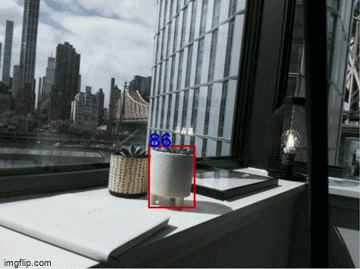
    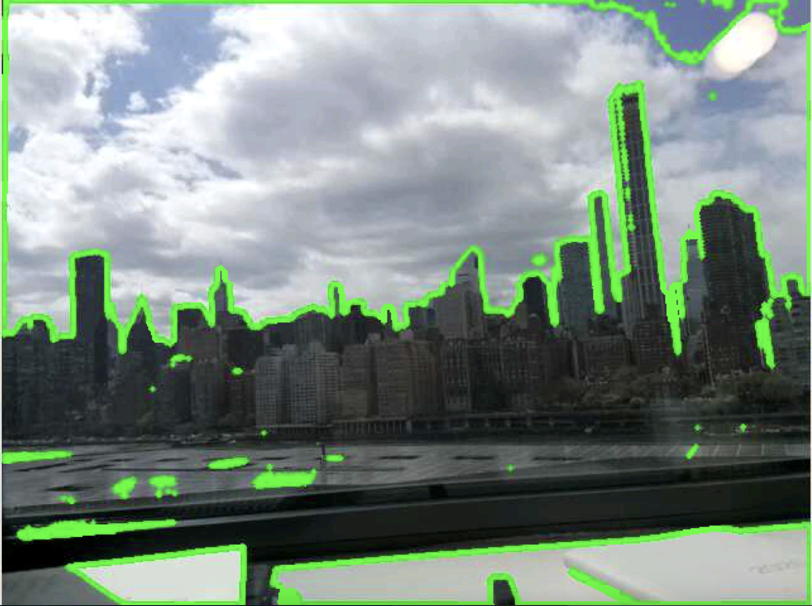
</p>

---

## ✅ Part C
### Test the interaction prototype

Idea chosen:
<p float="left">
    
</p>

Now flight test your interactive prototype and **note your observations**:
Teachable Machine is quite a powerful tool to do rapid prototyping, but it lacks robustness. For instance, I had made 3 total models since everyday I was working on the project I was wearing a different outfit. This is not ideal, since if I were to use my prototype in the real world I would need to train a new model for each specific situation. For instance, if my model is in an art exhibition counting how much time a user is looking at a piece of art, I may need to train the model with each single one of the customers visiting the expo beforehand: not ideal!

<p float="left">
    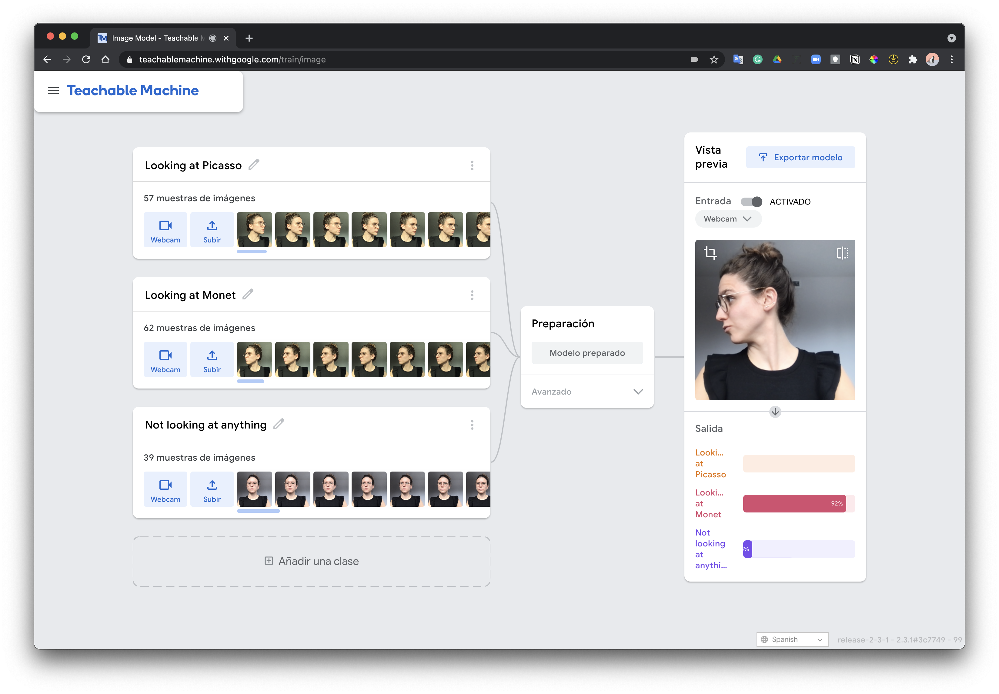
    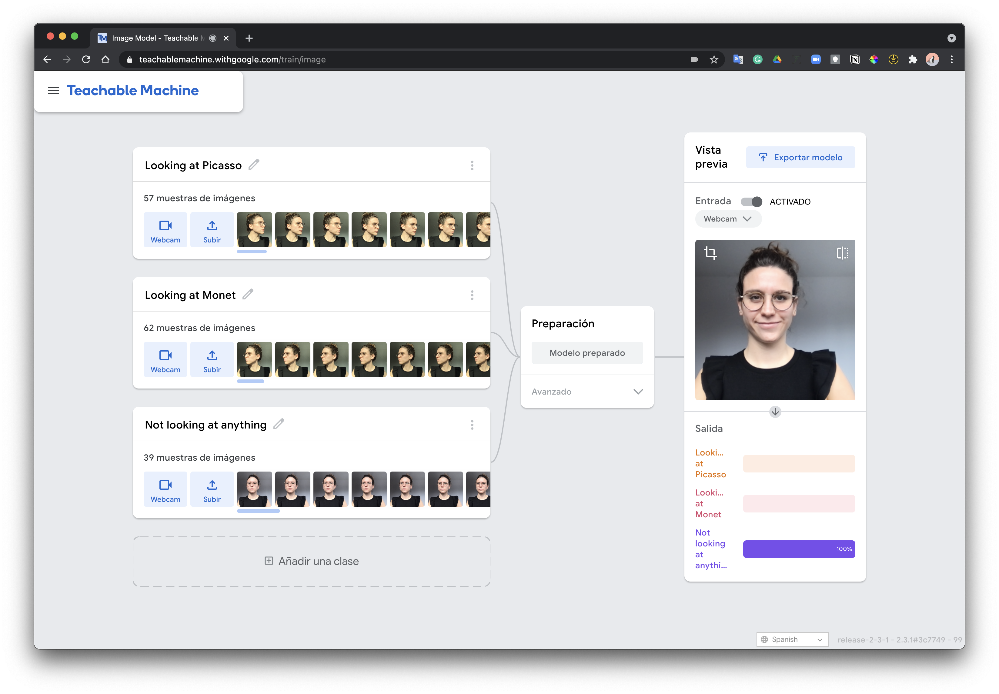
    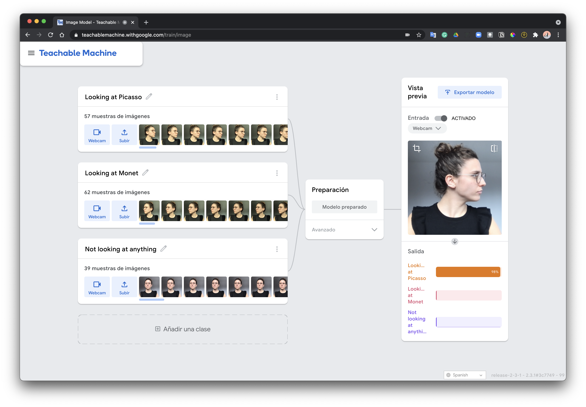
</p>

**Think about someone using the system. Describe how you think this will work.**
In a museum (for example) users will know there are cameras as it will be indicated for privacy concerns. However, this interaction pretends to be as seamless as possible so customers can be as genuine as possible when looking at the art. Let's see how much seamlessness I can achieve by the end of this lab!
Unfortunately, there is not a huge impact by miss classifications. The goal is to uncover or quantify the time a user spends looking at a piece of art, and compare to extract potential patterns. There could be other optimizations to improve the interaction, for instance, train a CNN to improve on robustness or to look at the eye gaze - which is probably the one that would work the best with a higher resolution camera.

<p float="left">
    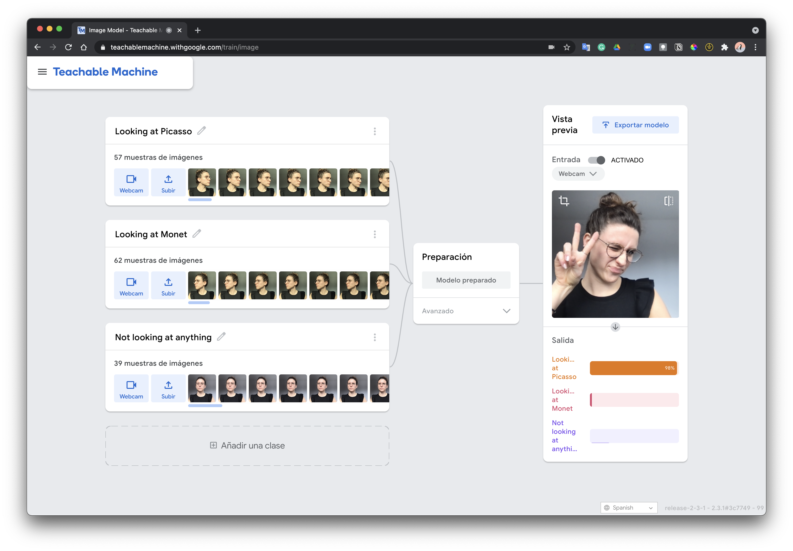
    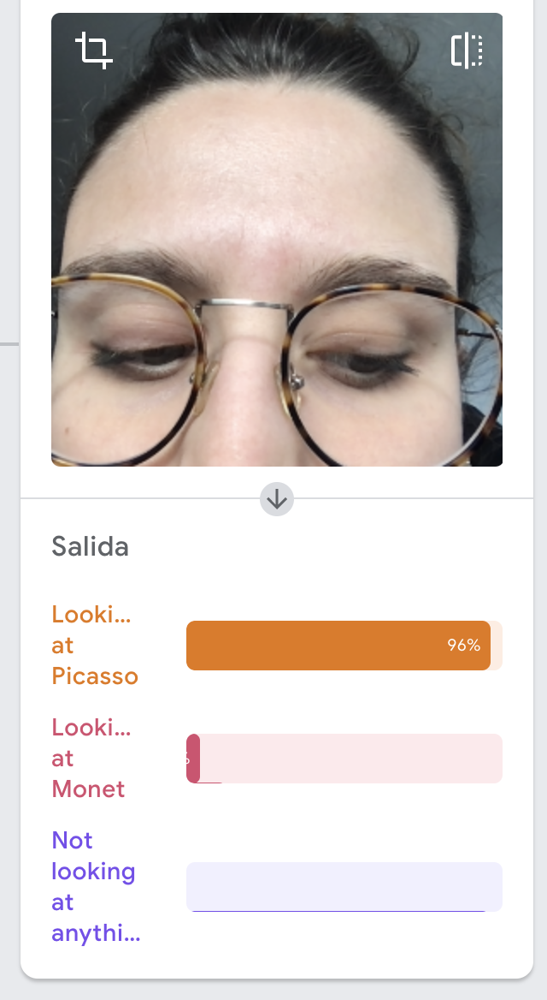
</p>

---
### Part D
### Characterize your own Observant system

Now that you have experimented with one or more of these sense-making systems **characterize their behavior**.
During the lecture, we mentioned questions to help characterize a material:
* What can you use X for?
* What is a good environment for X?
* What is a bad environment for X?
* When will X break?
* When it breaks how will X break?
* What are other properties/behaviors of X?
* How does X feel?

<p float="left">
    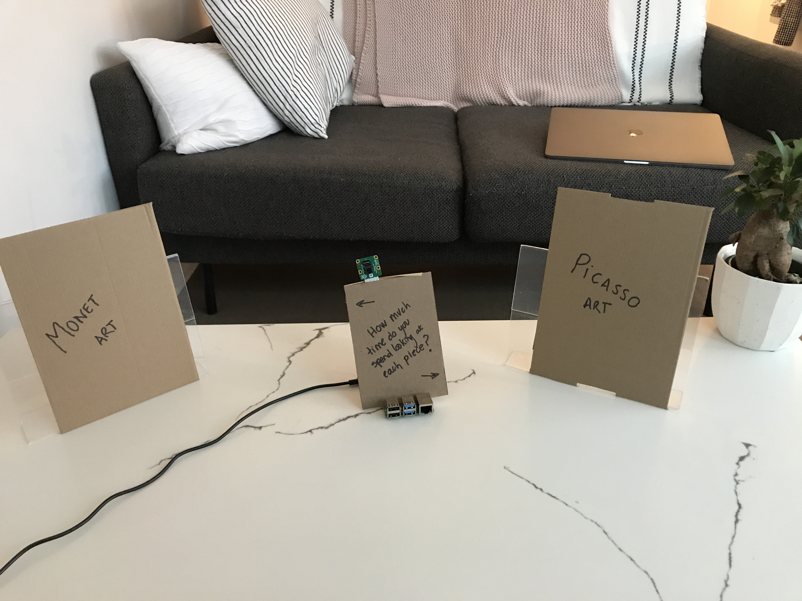
    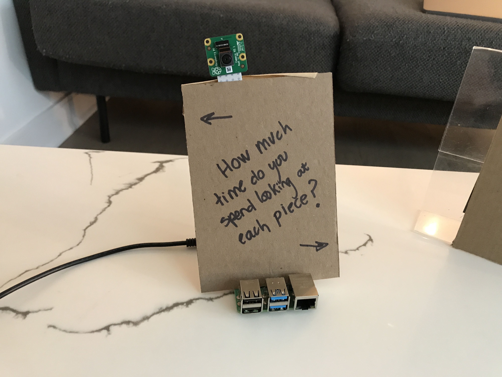
</p>

**Include a short video demonstrating the answers to these questions.**

<p float="left">
    
</p>

---
### Part 2.

Following exploration and reflection from Part 1, finish building your interactive system, and demonstrate it in use with a video.

<p float="left">
    
</p>

**Include a short video demonstrating the finished result.**

<p float="left">
    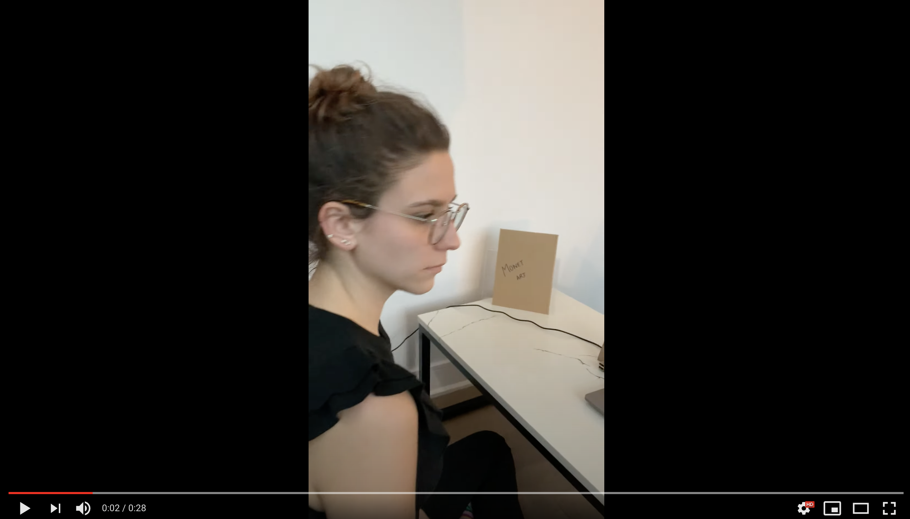
</p>

https://www.youtube.com/watch?v=nhwSUvh-Vuk
